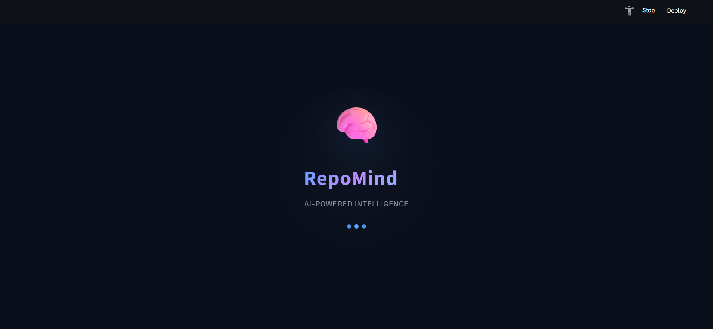
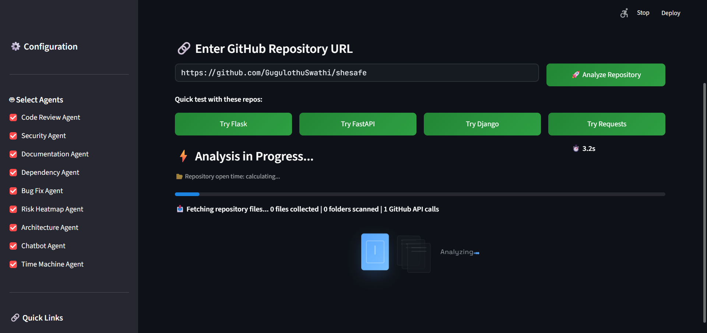
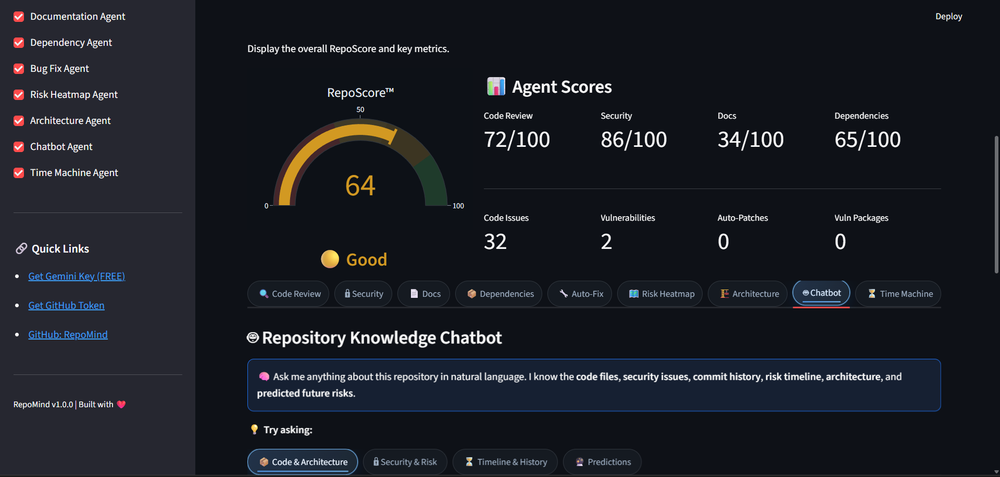

# RepoMind

RepoMind is a Streamlit app that analyzes GitHub repositories using multiple AI-powered agents.

It provides:
- Code quality review
- Security checks
- Documentation quality insights
- Dependency risk checks
- Bug-fix recommendations
- Risk heatmap and architecture analysis
- Repository time-machine timeline
- PDF report export

## Tech Stack

- Python
- Streamlit
- Google Gemini API
- GitHub API (PyGithub)
- Plotly + Pandas
- ReportLab

## Prerequisites

- Python 3.10+
- Git installed and available in PATH (required for Time Machine agent)
- A GitHub personal access token
- A Gemini API key

## Setup

1. Clone the repository and open it in VS Code.
2. Create and activate a virtual environment.
3. Install dependencies.
4. Create your env file from the example.

### Windows PowerShell

```powershell
python -m venv .venv
.\.venv\Scripts\Activate.ps1
pip install --upgrade pip
pip install -r requirements.txt
```

### Configure environment variables

Copy `.env.example` to `.env` and fill in real values.

```powershell
Copy-Item .env.example .env
```

## Run the app

```powershell
.\.venv\Scripts\python.exe -m streamlit run app.py
```

Open the local URL shown by Streamlit in your browser.

## Deploy on Streamlit Cloud

1. Push your latest code to GitHub.
2. Open Streamlit Cloud: https://share.streamlit.io
3. Click "New app".
4. Select your repository: `GugulothuSwathi/Repomind`.
5. Set branch to `main` and main file path to `app.py`.
6. In Advanced settings, add Secrets:

```toml
GEMINI_API_KEY = "your_gemini_key"
GITHUB_TOKEN = "your_github_token"
```

7. Click "Deploy".

Notes:
- `requirements.txt` is used automatically for package install.
- `runtime.txt` pins Python version for compatibility.
- Never commit real secrets to `.env` in Git.

## Environment Variables

- `GEMINI_API_KEY`: Google Gemini API key used by AI agents.
- `GITHUB_TOKEN`: GitHub token used to read repositories and post PR comments.

## Screenshots

### Splash Screen


### Configuration & Agent Selection


### Analysis Results - RepoScore & Agent Scores



